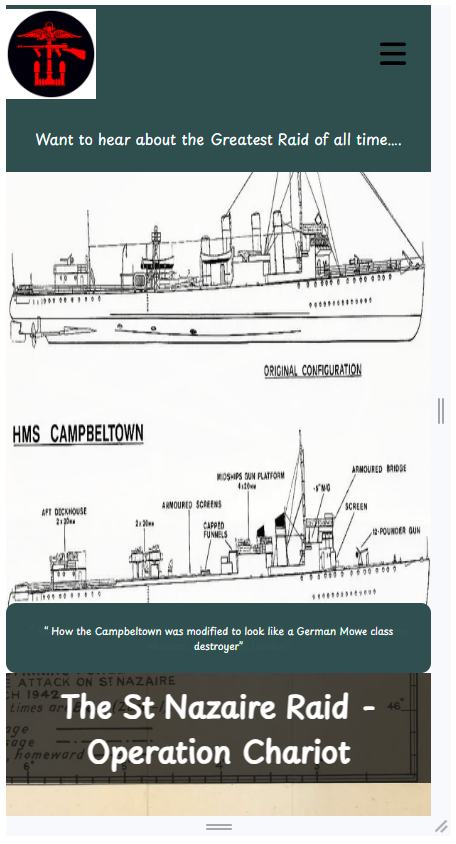
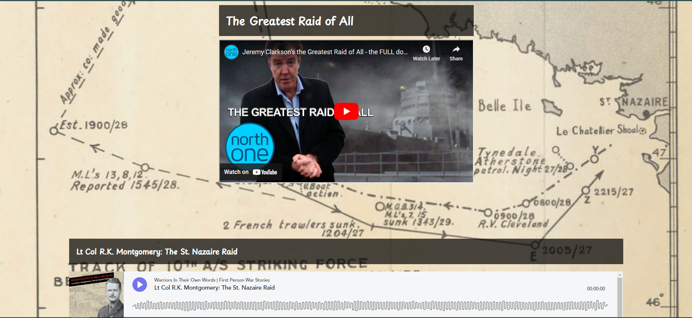
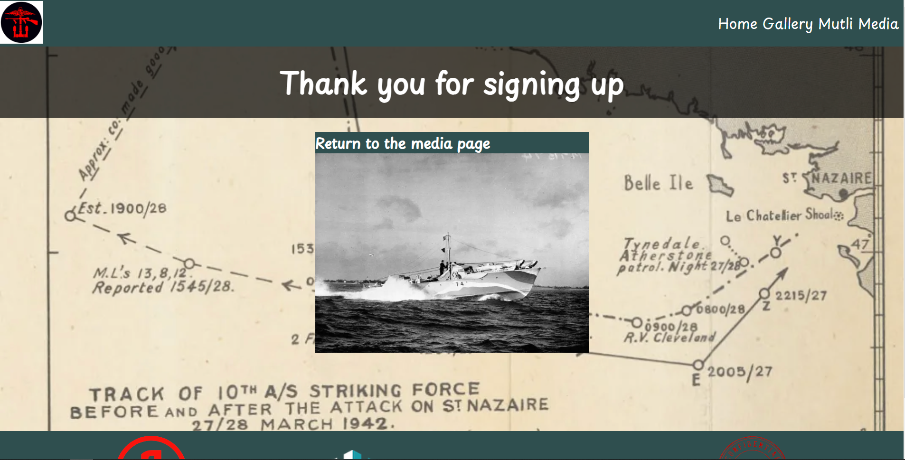
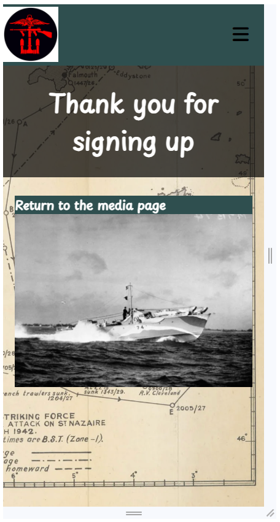

# St Nazaire Raid - Operation Chariot

## About the Project


I have created a website where a user can view infomration about the St Nazaire Raid which is a battle that took place during WW2 but is not so well known or famous as some other battles such as D-day or the Battle of Berlin. I'd argue thought, that it should equally be placed up there with other famous battles and that what was done on that fateful day was something that people have said was considered to be not possible and a suicide mission.

Through the website, I aim to show a user how the plan initially got its routes and the reasons such a plan had to come together. Then I will explain to the user both the battle itself and the struggles and problems that were faced by the attacking force, before finally finishing by showing where a person can visit the war memorial for this battle.

There are also links to further documents and videos where a user can find further information and even some first-hand accounts of the men who took part in the battle.

[Live Website Link](https://gmontaque.github.io/project1-st-nazaire-raid/)

## Target Audience

**What was the idea behind building the product?**

- To inform users about the raid and share the history
- To show the men who took part and what they endured
- Breakdown of why the raid happened and how it happened through different media sources

**What are the needs of our users and how do we address them?**

- Be able to find out information about the raid easily
- Understanding all aspects of the raid in more detail
- Users should feel they have a better understanding of the raid after going through the site
- The user should find the information in multiple sources to suit their needs
- Users should feel engaged

**How does the site meets the needs of user and business**

- A person with an interest in ww2 and famous battles can go through and absorb information
- There are further links to even more information from sources with more detail, allowing them to further their knowledge
- Images have been added so people can visualise the battle as well as read about the topic
- Content is easy to read and digest but provides all the details required
- Through the use of images and text the site will attract more users to the site and engage them
- The media content and links mean there is something for all users, which will help the site and business to get traffic
- SEO has been used throughout the site, increasing the SEO ranking of the site
- A form has been added so that further information can be emailed to the user keeping their interest in the site and knowledge of the site

## Features

### Page Features

**Navigation Bar**

- This appears on all 3 pages and is identical, it contains a full navigation bar and a logo which is the Combined Operations Shoulder Patch, the navigation bar is fully responsive and has a mobile version which appears when the screen size is the correct width. In the navigation bar, there are links to the home page, gallery and media page.
- Using the navigation bar the user can navigate all 3 pages, the logo is also a navigation link, and when clicked on it sends the user back to the home page.


**Landing Page Image**

- This is the first page the user sees when clicking on the website
- The user is greeted by a navigation bar, a hero image with a text overlay and the title of the website
- The text of the hero image is there to draw the user's eye and will put to them a question, the idea being to reaffirm what site they have clicked on and to also pique their interest to look further
- The hero section contains 3 images that rotate




**Home Page**

- The homepage contains the main written content of the website
- Here the battle is broken down into background, plan, battle and aftermath, each section explains the battle at that stage
- Images have been included to help the user visualise what is being explained
- Finally, an image of the memorial has been included so users can read what has been written to provide an emotive response to what they have read


**Battle Information Timeline**

- This section provides a timeline of events as they unfloded and guides the user through the story of the battle.
- Real-world images of the battle plan have been included so they can be viewed as the user reads on the topic.


**Footer**

- The footer section includes links to the other sites where the user can find information about the battle
- The footer is valuable as it allows people to find out further information and keep their interest for longer on the topic and site


**Gallery**

- The gallery provides images from the battle both before and after and will allow the user to better understand what happened
- It also allows the user to see different aspects of the battle from both the German and Allied side
- There are also included some of the soldiers themselves who took part


**Victoira Cross Winners**

- This section aims to highlight 5 inviduals who exceled themsevles during the battle and one of the highest awards the Victoria Cross.
- In this section, citations have been included which explain the reason why they were awarded the Victoria Cross
  - There is also a link to a website which contains all VC winners and provides some further information about each person
- This section is important as it gives an insight into the real people who were there


**Embeded Video and Podcast**

- Multi Media content has been included to add variety to the information sources on the website
- A video has been included which shows Jeremy Clarkson talking over the battle and has some first-hand accounts from people who were there, it also shows content not included in other aspects of the site
- There is also a voice recording by the commander of the battle where he talks through the battle
- These sections have been included to allow users who absorb information through video to get a full understanding of the battle




**Books on the Raid**

- Here the user can see books which realte to the raid and also books that are written by historians and first-hand accounts if they prefer
- The section also provides links to where they can go for further information
- This section is useful as it gives the user the ability to read over the topic in a more relaxed setting compared to viewing it on a screen


**Sign Up Form**

- Here i have included a sign up form
- The purpose of which is to better engage users and give them a reason to return to the site
- The form will sign up the user to a mailing list which will periodically send them out recommendations of either a book or film relating to the raid


## Page Breakdown

#### HOME Page

- Below you will find a direct link to the page, which contains the follow features:
  - Hero Image
  - Battle Timeline

[St Nazaire Raid Homepage](https://gmontaque.github.io/project1-st-nazaire-raid/)


#### GALLERY Page

- Below you will find a direct link to the page, which contains the follow features:
  - Gallery Images
  - VC Winners

[St Nazaire raid gallery page](https://gmontaque.github.io/project1-st-nazaire-raid/gallery.html)


#### Media Page

- Below you will find a direct link to the page, which contains the follow features:
  - Youtube video explaining the battle
  - Podcast from the commander of the raid
  - External book links
  - Form to sign up for film and book recommendatuions

[St Nazaire raid media page](https://gmontaque.github.io/project1-st-nazaire-raid/media-links.html)


#### Sign up Confirmation Page

- Here I have included a page that will appear to confirm to the user they have completed the form correctly




### Typography and Colour Scheme

- For the font i have used Playpen Sans [google font link](https://fonts.google.com/specimen/Playpen+Sans)
  - I have used this font as I was looking for a style that would appear to be handwritten
  - I have also used this font as the main background of the site contains an image from a declassified document about the raid, i was looking for a font style that matches this style of text
  - I also wanted the text to look as if it was from that time period
- For the colours I have kept this to simple colours of dark slate grey, black and white
  - These colours have been chosen due to the time period the website covers 1939-1945
  - During this time period most images were black and white
  - I wanted the colour scheme to follow the background which is taken from a declassified document

### WIREFRAMES

#### HOME PAGE

- The idea of the the homepage was to create something that had a large clear image at the top and within a few seconds the user should be able to tell what the website is about
- The homepage was also to contain the content of the battle and break it down into several sections either 4 or 5
- Each section was to have both images and text to balance out the page


#### GALLERY PAGE

- This page was to be made up of 2 parts a gallery section and vc winners section
- The gallery section is to include real images either from before or after the battle as well as images related to the battle
- The images would be responsive in design
- Below or above that there would be a VC winners section, this would describe the VC winners and provide comments about them


#### Media PAGE

- This page includes some more visual content as well as some offical videos and interviews
- The page is to contain some embedded content from other sites to give people a more broad experience
- The layout would be set to one or two videos coupled with some book recommendations
- The book recommendation section would also provide a link so the user can go on purchase the book if they so wish


### Mobile Wireframe

- Here i have created the wireframe for how the website should look on mobile


## Testing

- I have tested the website in different broswers such as google, firefox and Edge
- On each browser, I have gone into the dev tools and tested the website at different screen sizes, from mobile to full size. Examples below from Firefox and Edge:


- I have used lighthouse to test the website as per the image below:


- Validation from homepage
  

- Validation for gallery page
  

- Validation for media page
  

### Validator Testing

- I have tested all HTML pages on the HTML validator and there are no errors

  - Home Page
  - Gallery Page
  - Media Page

- When building the website I have used an extension called pritter which has resulted in the warnings that you can see on each screenshot below:

  - No errors were returned when passing through the official [W3C validator](https://validator.w3.org/nu/?doc=https%3A%2F%2Fcode-institute-org.github.io%2Flove-running-2.0%2Findex.html)

  

- When testing my CSS as you can see from the below image there are no errors

  - No errors were found when passing through the official [(Jigsaw) validator](https://jigsaw.w3.org/css-validator/validator)


- When testing the website on different devices i have used the pre-defined dimensions that come with the developer tools on Google Chrome
- I have also researched several websites which have described the most common screen size for devices in 2023 for desktop and mobile - https://www.designrush.com/agency/web-development-companies/trends/website-dimensions


**External Links**

- I have tested each external link to make sure that it goes to the correct website
- I have also tested the links to make sure that they all open the website on a new broswer tab

**Mobile Na0vbar Header**

- The navbar on mobile has been tested to make sure that it appears when the burger is clicked
- The navbar has been testing to make sure that the large screen navbar disappears and only the mobile version is visible

**Colour Scheme**

- The colour scheme of dark slate gray, black and white was used as when checking on the colour contrast ratio they passed all tests


### Issues and Bugs

- Initally when creating the webiste I had an issue that the website was always slightly too big for the screen, my first thought was that there was an element that was pushing out of its parent element
  - The issue was that I was missing a max-width on the body parent element, to solve this issue I had to add a max-width to the correct element and this fixed the issue
- Another issue I faced was concerning the embedded video and podcast, when I added these into my code they came with some pre-set dimensions and also caused an issue with the validation
  - To solve this issue I removed the CSS which came with the video and podcast and added my own CSS to re-style both elements, I also followed the recommendations of the validator
- When validating my code I found there was an issue with the mobile navigation bar, the error related to the value given to the "for" attribute and the value given the the "name" attribute did not match. When correcting this initially it broke the styling that was applied to the checkbox.
  - To solve this issue I had to go through the mobile navigation code as well as the developer tools to understand what classes were being added and what classes were not being added. From this, I could understand what the issue was and how to fix it which was to update the class name.

### Performance

- When testing the website on Pagespeed I found there was a reduction in performance, to resolve this I updated all images to webp
- The reason for this is that there is a signification reduction in the size of the image without a loss of quality which results in a faster website loading time
- Other benefits include reduced bandwidth

### SEO

- To improve the SEO side of the webiste i have included the follow code below.
  - I have added a meta section which includes certain keywords, meaning that when a user searches these words there is a higher chance that my site will appear in the search results
  - There is also a title included which will be picked up by Google when a search is completed

```
<!-- title and tab icon -->

    <link
      rel="icon"
      type="images/x-icon"
      href="assets/images/commando-insignia.jpg" />

    <title>St Nazaire Raid</title>

    <!-- Meta tags for search engines -->

    <meta
      name="description"
      content="WW2, France, British, Germans, st nazaire, royal navy"  />
    <meta name="keywords" content="WW2, raid, British, Commando, Raid" />
```

## Deployment

- The site was deployed to GitHub pages. The steps to deploy are as follows:
  - In the GitHub repository, navigate to the Settings tab
  - From the source section drop-down menu, select the Master Branch
  - Once the master branch has been selected, the page will be automatically refreshed with a detailed ribbon display to indicate the successful deployment.

The live link can be found here - https://gmontaque.github.io/project1-st-nazaire-raid/index.html

## Credit and content

#### Icons

- All icons used in the website were taken from Fontawesome [Font Awesome](https://fontawesome.com/)

#### Home Page

- The content of the text on the home page came from the follow websites:
  - https://www.combinedops.com/St%20Nazaire.htm
- For the hero slider i took insperation from the follow code:
  - https://codepen.io/LalexG/pen/VxVzeE
- For the mobile Navigation Bar as a frame work i used code from the follow site:
  - https://codepen.io/alvarotrigo/pen/wvrzPWL

#### Gallery page

- the vc content came from the follow website
- https://vcgca.org/our-people/action-and-memorial-locations

#### Media Page

- Written cotent of the review of the greatest raid book came from - https://www.amazon.co.uk/Greatest-Raid-Nazaire-Operation-Chariot/dp/0241992257#:~:text=Under%20orders%20to%20attack%20the,than%20in%20any%20similar%20operation.
- Written content fo the review of the book into the jaws of death came from - https://robertlyman.com/book/into-the-jaws-of-death/

#### Footer

- In the footer from left to right the information was gained as follows:
  - First link is the logo for the St Naizare town webiste and the link takes you to the side - https://www.saint-nazaire-tourisme.uk/explore/discover-our-heritage/war-and-peace-stories/
  - The second image is taken from a history website - https://shows.acast.com/dansnowshistoryhit/episodes/destroying-a-nazi-stronghold-the-st-nazaire-raid
  - The third is taken from the Australian goverment website and is of a declassified document of the raid - https://www.navy.gov.au/sites/default/files/documents/Battle_Summary_12.pdf

### Media and Images

- Background Image - https://www.navy.gov.au/sites/default/files/documents/Battle_Summary_12.pdf
- Images used on home page
  - https://discover.hubpages.com/education/The-Greatest-Raid-of-All-Operation-Chariot-St-Nazaire-27th-March-1942
  - https://www.worldnavalships.com/forums/thread.php?threadid=1099
- Images used in gallery page

  - https://militaryhistorynow.com/2022/02/22/operation-chariot-inside-britains-daring-commando-raid-on-st-nazaire/
  - https://warfarehistorynetwork.com/article/the-st-nazaire-raid/
  - https://www.nationalww2museum.org/war/articles/bold-strategy-british-raid-st-nazaire
  - https://www.nationalww2museum.org/war/articles/british-raid-st-nazaire-part-ii
  - https://www.combinedops.com/St%20Nazaire.htm
  - https://www.commandoveterans.org/Chariot
  - https://www.businessinsider.com/daring-british-st-nazaire-raid-kept-tirpitz-out-of-war-2022-3?r=US&IR=T

- Images used in media page
  - https://rupertcolley.com/2015/03/28/saint-nazaire-raid-summary/
- Video was taken from North One youtube channel - https://www.youtube.com/watch?v=07Zd0Oy8JyQ
- Podcast of Lt Col R.K. Montgomery was taken from - https://evergreenpodcasts.com/warriors-in-their-own-words/lt-col-r-k-montgomery-the-st-nazaire-raid
