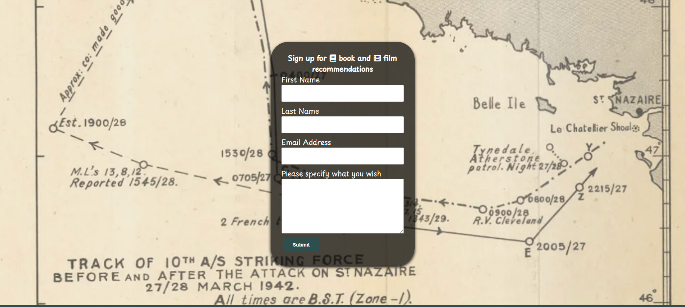
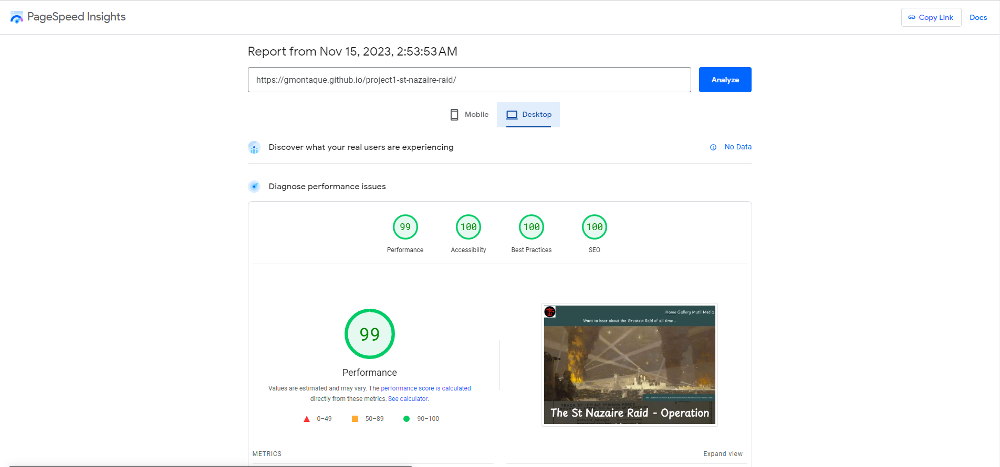
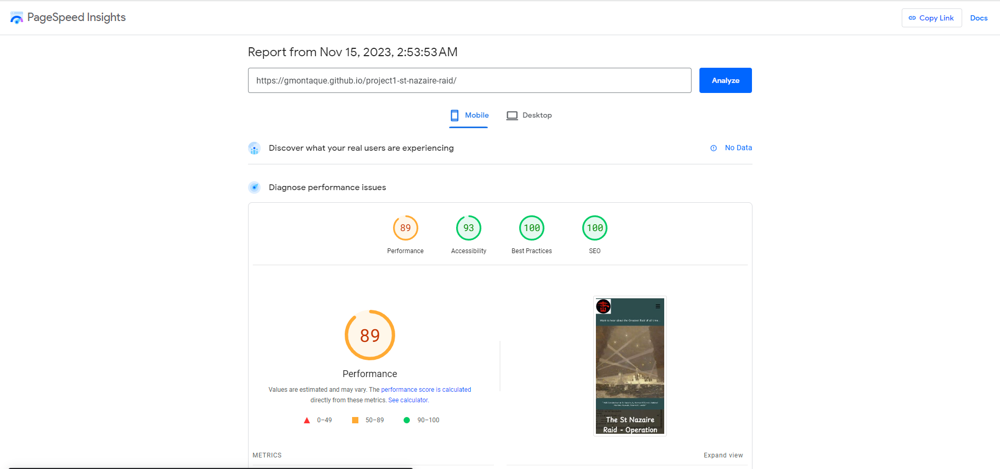

# St Nazaire Raid - Operation Chariot

## Table of Content

- contain list of different sections of readme

## About the project

I have created a website where a user can view infomration about the St Nazaire Raid which is a battle that took place during WW2 but is not so well known or famous as some other battles such as D-day or the battle of berlin. But i'd i argue should equally be placed up there and what was done on that fatful day was something that people have said was considered to be not possible and a sucide mission.

Through the website I aim to show a yuser how the plan initally got it routes and the reasons such a plan had to come together, and then it will be explained to them both the battle itelf and the stuggles and problems that was faced by the attacking force, before finally finishing by showing where a person can visit the war memorial for this battle.

There are also links to further docuemnts and videos where a user can find further information and even some first hand accounts of the men who took part in the battle.

## Target audience

**What was the idea behind building the product?**

- To inform users about the raid and share the history
- To show the men who took part and what they endured
- Breakdown why the raid happened and how it happened through different media sources

**What are the needs of our users and how do we address them?**

- Be able to find out information about the raid easily
- Understanding the raid in more detail
- User should feel they have a better understanding about the raid after going through the site
- The user should find the information in multipul sorces to suit their needs

**How does the site meets the needs of user and business**

- A person with an interest in ww2 and famous battle can go through and abosrbe information
- There are further links to even more information from sources with more detail, allowing them to further their knowledge
- Images have been added so people can visualise the battle as well as reading about the topic
- Content is easy to read and digest but provides all the detail required
- Through the use of the images and text the site will attract more users to the site and engange them
- The media content and links means there is something for all users, which will help the site and buiness to get traffic
- SEO has been used throughout the site, inceasing teh SEO ranking of the site

## Features

### Page Features

**Navigation Bar**

- this appears on all 3 pages and is identical, it contains a full navigation bar and a logo which is the Combined Operations Shoulder Patch, the navigation bar is fully responsive and has a mobile version which appears when the screen size is the correct width. Iin the navigation bar there are links to the home page, gallery and media page.
- Using the naviatation bar the user can navigate all 3 pages, the logo is also a navigation link, when clicked on it send the user back to the home page.

**The landing page image**

- This is the first page the user sees when clicking on the website
- The user is greeted by a navigation bar, a hero image with a text overlay and the title of the webiste
- The text of the hero image is there to draw the users eye and will put to them a question, the idea being to reafirm what site they have clicked on and to also peak there interet to look further
- The hero section contains 3 images that rotate

**Home Page**

- The homepage contains the main written content of the website
- Here the battle is broken down into background, plan, battle and aftermath, each section explains the battle at that stage
- Images have been included to help the user visual what is being explained
- Finally an image of the memorial has been included so user can clearly read what has been written to provide an emotive response to what they have read

**Battle information timeline**

- This section provides a timeline of events as they unfloded and guides the user through the story of the battle.
- Real world images of the battle plan have been included so they can be viewed as the user reads on the topic.

**Footer**

- The footer section includes links to the other sites where the user can find out information about the battle
- The footer is valuable as it allows people to find out further infomration and keep there interest for longer on the topic and site

**Gallery**

- The gallery provides images from the battle both before and after and will allow the user to better understand what happened
- It also allows the user to see different aspects of the battle from both the german and allied side
- There are also included some the sodlers themselves who took part

**VC winners**

- This section aims to highlight 5 inviduals who exceled themsevles during the battle and one the highest award teh victoria cross.
- In this section citation have been included which explain the reason why they were awared the victoria cross
  - There is also a link to a wbsite which contains all VC winners and provide some further infomration about each person who one
- This section is important as it gives an insite into the real people who were there

**embeded video and podcast**

- Multi Media content has been included to add variety to the information sources
- A video has been included which shows jeremy clarkson talking over the battle and has some first hand account from people who were there, it also shows content not included in other asspects of the site
- There is also a vocice recording by the commander of the battle where he talks through the battle
- These sections ahve been included to allows uers who absorb infomration thorugh video to all get a full understanding of the battle

**Books on the raid**

- Here the user can see books which realte to the raid and also books that are written from histroians and first hand accounts if they prefer to read
- The section also provides links to w1here they can be more for further information
- This section is useful as it gives the user the ability to read over the topic in a more relax setting compared to viewing it on a screen

**sign up form**

- here i have inclueded a sign up form
- the purpose of which to better engage user and give them a reason to return to the site
- the form will sign up the user to a mailing list which will perioditcally send them out recommendation of either a book or film relating to the raid

## Page Breakdown

#### HOME Page

- Below you will find a direct link to the page, which contains the follow features:
  - hero image
  - battle timeline

[St Nazaire raid homepage](https://gmontaque.github.io/project1-st-nazaire-raid/)

#### GALLERY Page

- Below you will find a direct link to the page, which contains the follow features:
  - gallery images
  - vc winners

[St Nazaire raid gallery page](https://gmontaque.github.io/project1-st-nazaire-raid/gallery.html)

#### Media Page

- Below you will find a direct link to the page, which contains the follow features:
  - Youtube video explaining the battle
  - podcast from the commander of the raid
  - external book links
  - form to sign up for film and book recommendatuions

[St Nazaire raid media page](https://gmontaque.github.io/project1-st-nazaire-raid/media-links.html)

### Typography and color scheme

- For the font i have used Playpen Sans [google font link](https://fonts.google.com/specimen/Playpen+Sans)
  - i have used this font as i was looking for a style that would appear to be hand wriotten
  - i have also used this font as the main background of the site contains an image from a declassifed doucemnt about the raid, i was looking for a font style that match this style of text
  - i also wanted the text to almost look as if it was from that time period
- for the colours i have kept this to simple colours of dark slate grey, black and white
  - these colours ahv been choosen due to the time period the website cover 1939-1945
  - during this period most images were black and white
  - also i wanted the colour scheme to follow the background which is taken from a declassifed document

### WIREFRAMES

#### HOME PAGE

- the idea of the the homepage was to create something that had a large clear image at the top and within the few seconds the user should clearly be able to tell what the website is about
- the homepage was also to contain the content of the battle and break it down into a number of sections either 4 or 5
- each section was to have both image and text to balance out the page

#### GALLERY PAGE

- this page was to be made up of 2 parts a gallery section and vc winners section
- the gallery section is to include all real images either from before or after the battle and aswell as images related to the battle
- the images would be responsive in desgin
- below or about that there would be a vc winners section, this would describe the person and provide comments about them

#### media PAGE

- this page included some more visual content as well as some offical videos and interviews
- the page is to comtain some embed content from other site to give people a more broad expericne
- the layout would be set to one or two videos coupled with some book recommendations
- the book recommendation section would also provide a link so the user can go onto purchase the book if they so wish

## Testing

- i have tested the website in different broswers such as google, firefox and edge
- on each browser i have gone into the dev tools and tested the websiet at different screen sizes
- I have used lighthouse to test the website as per the image below:

- validation from homepage
  

- validation for gallery page
  

- validation for media page
  

### Validator Testing

- I have tested all HTML pages on the HTML validator and there are no errors

  - home page
  - gallery page
  - media page

- when building the website have used an extension called pritter which has resulted in the warning that you can see on each screenshot

  - No errors were returned when passing through the official [W3C validator](https://validator.w3.org/nu/?doc=https%3A%2F%2Fcode-institute-org.github.io%2Flove-running-2.0%2Findex.html)

  

- When testing my CSS as you can see from the below image tehre were no errors

  - No errors were found when passing through the official [(Jigsaw) validator](https://jigsaw.w3.org/css-validator/validator)

- when testing the website on different devices i have used the pre-defined dimensions that come with the developer tool on google chrome
- i have also reasearch a number of website which have described the most connon screen size for devices in 2023 for desktop and mobile - https://www.designrush.com/agency/web-development-companies/trends/website-dimensions

**external links**

- i have tested each external link to make sure that it goes to the correct website
- I have also tested the links to make sure that they all open the website on a new broswer tab

**mobile navbar header**

- the navbar on mobile has been tested to make sure that it appears when the burger is clicked
- the navbar has been test to make sure that the large screen navbar disappers and only the mobile version is visible

**Colour Scheme**

- the colour scheme of dark slate gray, black and white was also used as when checking on the colour contrast ratio they passed all tests

## Deployment

This section should describe the process you went through to deploy the project to a hosting platform (e.g. GitHub)

- The site was deployed to GitHub pages. The steps to deploy are as follows:
  - In the GitHub repository, navigate to the Settings tab
  - From the source section drop-down menu, select the Master Branch
  - Once the master branch has been selected, the page will be automatically refreshed with a detailed ribbon display to indicate the successful deployment.

The live link can be found here - https://gmontaque.github.io/project1-st-nazaire-raid/index.html

### Issues and Bugs

- inital when creating the webiste i had an issue that the website was always slightling to big for the screen, my first thought was that there was an element that was pushing out of its parent element
  - the issue was that i was missing a max-width on the body parent element, once this was added the issue was fixed
- another issue i faced was with regards to the embeded video and podcast, when i added these into my code they came with some pre-set dimensions and also caused an issue with the validation
  - to solve this issue i removed the css which came with the video and podcast and added in my own css to re-style both elements, i also followed the recommendations of the validator

## Credit and content

#### Icons

- all icons used in the website were taken from Fontawesome [Font Awesome](https://fontawesome.com/)

#### Home Page

- the content of the text on the home page came from the follow websites:
  - https://www.combinedops.com/St%20Nazaire.htm

#### Gallery page

- the vc content came from the follow website
- https://vcgca.org/our-people/action-and-memorial-locations

#### Media Page

- written cotent of the review of the greatest raid book came from - https://www.amazon.co.uk/Greatest-Raid-Nazaire-Operation-Chariot/dp/0241992257#:~:text=Under%20orders%20to%20attack%20the,than%20in%20any%20similar%20operation.
- written content fo the review of the book into the jaws of death came from - https://robertlyman.com/book/into-the-jaws-of-death/

#### Footer

- in the footer from left to right the information was gained as follows
  - first link is the logo for the St Naizare town webiste and the link takes you to the side - https://www.saint-nazaire-tourisme.uk/explore/discover-our-heritage/war-and-peace-stories/
  - the second image is taken from a history website - https://shows.acast.com/dansnowshistoryhit/episodes/destroying-a-nazi-stronghold-the-st-nazaire-raid
  - the third is taken from the ausrtialn goverment website and is of a declassifed docuemtn of the raid - https://www.navy.gov.au/sites/default/files/documents/Battle_Summary_12.pdf

### Media and Images

- background image - https://www.navy.gov.au/sites/default/files/documents/Battle_Summary_12.pdf
- images used on home page
  - https://discover.hubpages.com/education/The-Greatest-Raid-of-All-Operation-Chariot-St-Nazaire-27th-March-1942
  - https://www.worldnavalships.com/forums/thread.php?threadid=1099
- images used in gallery page

  - https://militaryhistorynow.com/2022/02/22/operation-chariot-inside-britains-daring-commando-raid-on-st-nazaire/
  - https://warfarehistorynetwork.com/article/the-st-nazaire-raid/
  - https://www.nationalww2museum.org/war/articles/bold-strategy-british-raid-st-nazaire
  - https://www.nationalww2museum.org/war/articles/british-raid-st-nazaire-part-ii
  - https://www.combinedops.com/St%20Nazaire.htm
  - https://www.commandoveterans.org/Chariot
  - https://www.businessinsider.com/daring-british-st-nazaire-raid-kept-tirpitz-out-of-war-2022-3?r=US&IR=T

- Images used in media page
  - https://rupertcolley.com/2015/03/28/saint-nazaire-raid-summary/
- Video was taken from North One youtube channel - https://www.youtube.com/watch?v=07Zd0Oy8JyQ
- Podcast of Lt Col R.K. Montgomery was taken from - https://evergreenpodcasts.com/warriors-in-their-own-words/lt-col-r-k-montgomery-the-st-nazaire-raid
